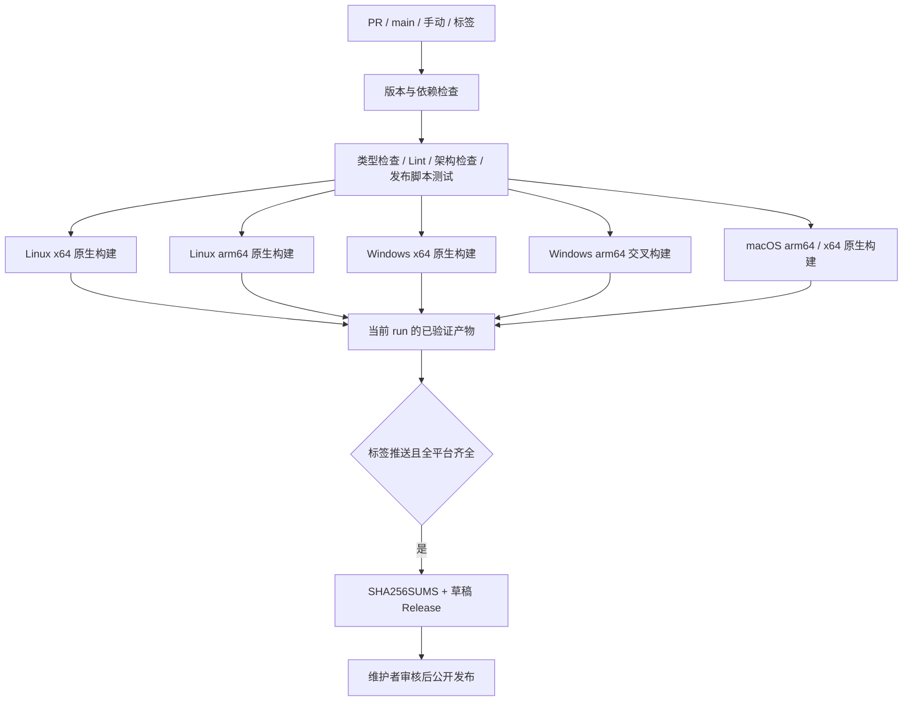
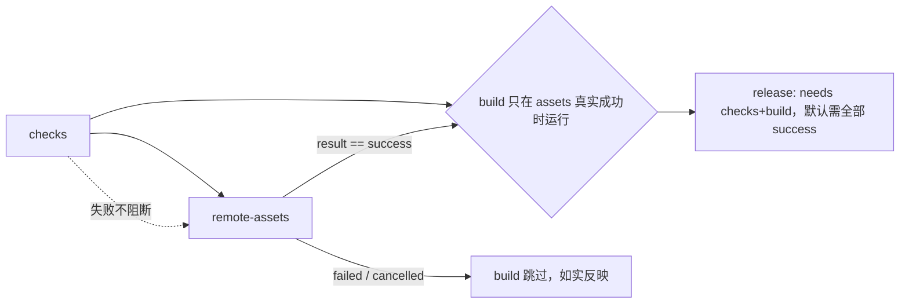

# Linux / Windows 桌面 CI 与草稿发布

## 范围与产品规则

- 构建矩阵覆盖 Linux x64/arm64、Windows x64/arm64、macOS arm64/x64；除 Windows arm64 在 x64 runner 上交叉打包外，均使用 GitHub 托管的**原生** runner（Linux arm64 用 `ubuntu-24.04-arm`）。
- PR、main 推送、手动运行和 `v*` 标签推送均执行检查与全平台打包。
- Linux 沿用现有 AppImage、deb、rpm、pkg.tar.zst，Windows 沿用 NSIS exe，macOS 发 dmg 与 zip。
- 产物文件名遵循现有打包器的架构命名（`builder-util` 的 `getArtifactArchName`，按 target 名判定）：
  - deb：x64 → `amd64`，arm64 → `arm64`；
  - AppImage：x64 → `x86_64`，arm64 → `arm64`；
  - rpm：x64 → `x86_64`，arm64 → `aarch64`；
  - pacman（`pkg.tar.zst`）：x64 → `x64`，arm64 → `aarch64`。
- pacman 与 rpm 的 arm64 名是 `aarch64` 而 AppImage/deb 是 `arm64`：`getArtifactArchName` 只在 `pacman`/`rpm`/`flatpak` 三个 target 上把 arm64 改写为 `aarch64`，x64 不在其特例表里所以保持 `x64`。已由 linux arm64 构建实测确认四种格式的产物名。
- 同一架构族在不同格式里的写法不同，按 arch 筛选时必须归一（`ARCH_ALIASES`），否则 `x64` 匹配不到 deb/AppImage。
- 只有版本标签推送允许创建 GitHub **草稿** Release，公开发布由维护者审核后操作。
- 带预发布标识的版本同时标记为 prerelease，审核发布时不会被误当作稳定版本。
- 标签必须为 `v<package.json.version>`，版本需满足 SemVer（可带预发布标识，不接受 build metadata）。无效标签在构建前失败。
- 滚动版本串（`scripts/rolling-app-version.mjs` 的 `collectRollingAppVersion`）是 `mock-cdn/releases/<version>` 目录名、`manifest.appVersion` 与打包侧 `appInfo.version` 的唯一来源；三者在单次构建内必须同源。
- 依赖安装使用 frozen lockfile。Node 从 mise.toml、pnpm 从 package.json 读取；同步已有依赖遗漏的锁文件项，不升级业务依赖。
- 工具链读取器显式解析 mise.toml 的 tools 表，只接受固定版本，并验证 pnpm 与 packageManager 一致；缺失或不一致时在安装前失败。
- 构建只使用当前源码与仓库已有资源，不读取 references/，不需要官方账号、服务凭据、私有镜像或签名证书。
- 本 PR 不迁移技能、不新增 CUA 原生实现、不配置应用内自动更新；现有账号及遥测代码的全面移除另行实施。

## 所有者、接口与事件顺序

GitHub Actions 工作流拥有调度和权限；现有 `bundle:desktop` 拥有构建、运行时依赖验证与体积审计；发布脚本只拥有产物筛选、校验和及草稿上传，不复制业务状态。

版本串所有权：`prepare:runtime-assets` 必须在任何消费方读取版本前先落盘 `build-meta.json`（即先执行 `prepare:build-meta`，再执行 `prepare:remote-assets`）。`prepare:remote-assets` 把 `appVersion` 烧进 `bundled-remote-assets` 的 manifest，electron-builder 的 beforePack/afterPack 用 `context.packager.appInfo.version` 校验同一份 manifest；两侧都经 `getBuildMetadata()` 读同一份缓存，因此缓存刷新必须早于第一次读取。

构建阶段不重复执行：`bundle:desktop` 串联 `prepare:runtime-assets` 与构建脚本。`build` 自身以 `prepare:runtime-assets` 开头，因此显式准备过运行时资产后只能调用 `build:no-runtime-assets`；否则 `prepare:remote-assets`（实测约 42s）与 `prepare:agent-bundle`（实测约 31s）整段重复执行。`--skip-prepare` 的语义是「不单独跑准备阶段、交给 `build` 自己准备」，此时才调用完整的 `build`。

- 检查与构建仅 `contents: read`；仅标签发布 job 拥有 `contents: write`，token 只在上传步骤注入。
- checkout 不保留凭据；不使用 pull_request_target，不使用 PR 输入拼接 shell 命令。
- PR/main/手动运行仅上传 Actions artifacts；构建阶段显式禁止 electron-builder 自动发布。
- 同一 ref 的普通构建允许取消旧运行；标签发布串行且不取消在途运行。
- 发布仅消费当前 run 的固定 artifact。任何平台缺失、错误版本、空文件或额外文件均拒绝上传。
- SHA256SUMS 由最终下载后的文件生成。重跑仅可更新同标签草稿；已公开 Release 拒绝覆盖。
- 发布 job 是 Release 的唯一写入者；失败不会自动发布。上传中断可能留下草稿，重跑覆盖同名草稿资产。

## 检查、远端资产与打包的 needs 图与失败语义

`checks`（coverage 型源码门禁）、`remote-assets`（真实构建并上传 Linux x64 远端运行时）、`build`（各平台打包）是相互独立的缺陷类，不能用一个 job 的 success 掩盖另一个：

- `remote-assets` 只按 `!cancelled()` 门禁：`checks` 失败（非取消）时仍要真实构建并上传资产，否则 `build` 只能拿到不存在的 artifact。取消 run 时不启动构建。
- `build` / `build-macos` 用 `needs.remote-assets.result == 'success'` 而不看 `checks`：checks 红但 assets 成功时继续打包，保留「检查与打包独立」的产品规则；assets 失败或取消时跳过，避免四个平台各自重复报 artifact-not-found。
- 不引入 `continue-on-error`、`if-no-files-found: ignore` 或 artifact 静默 fallback；跳过/失败状态必须诚实可读。
- `release` 保持 `needs: [checks, build, build-macos]` 的默认全成功语义，`checks` 失败时绝不创建草稿。

## 验收场景

1. fork PR 无仓库写权限也能运行检查与全平台构建；不触发发布。
2. 各平台独立产生所有预期安装包，并通过已有 app.asar 运行时依赖校验。
3. 手动运行可下载各平台产物，标签上下文的手动运行仍不创建 Release。
4. 合法标签、全平台构建与检查全部成功后，只生成草稿及 SHA256SUMS；维护者仍须手动发布。
5. 版本不匹配、单平台失败、缺包、错版本和空包阻断发布；重跑不能覆盖公开 Release。
   5a. 在已有陈旧 `build-meta.json` 的工作区里，`bundle:desktop --os linux --arch x64` 不得因 `Bundled remote appVersion mismatch` 失败；烘焙出的 `manifest-linux-x64.json` 的 `appVersion` 必须等于当前 HEAD 算出的滚动版本。
6. 发布辅助脚本用临时目录和模拟 GitHub 调用测试，覆盖以上失败语义，不访问真实 Release。
7. Linux arm64 与 Linux x64 的产物按 arch 分别收集，互不覆盖；`deb`/`AppImage`/`rpm`/`pacman` 的 arm 架构名与 `builder-util` 的实际命名一致。
8. 原生 runner 上执行 CUA 原生库与打包后 Electron 运行时探针；交叉打包的架构只校验随包资产文件（`--files-only`）。
9. 执行 typecheck、lint、架构检查以及工作流语法验证；已有失败或环境限制如实记录，不降级门禁。

## 检查阶段的源码测试

Checks 中的诊断回归直接读取受检源码，不依赖 CLI package 的 `dist`、历史 bundle 或本地增量构建缓存。诊断测试入口共用独立 tsconfig，将需要的 `@zcode/contracts` 公共入口解析到契约源码，并保留 UI 的 `@/*` 源码别名；静态与测试执行时的动态导入使用同一配置。不修改生产 package exports，也不为测试加载整个 CLI 构建流程。

验收：隐藏全部 CLI workspace 构建输出后，使用与 CI 相同的 `node --test --test-isolation=none scripts/ci/*.test.mjs` 执行，必须实际加载全部诊断子用例；导入失败不能算作未执行的成功测试。

浏览器 smoke 的同步契约：断言必须等待 UI 可观察状态（例如菜单触发器 enabled），不能把偶然的 DOM 变化（例如 file input 被 `input.remove()`）当作状态已解锁的信号。`useConversationArchiveImport` 在取消/完成路径里由 `busyRef` + `setBusy` 解除 busy，React 提交发生在这类同步 DOM 清理之后，因此旧式「input 移除即解锁」断言会抢跑。等待真实状态仍保留取消零 `beginArchiveImport`、重复导入与 host generation stale guard 的断言。

## 发行边界

- 桌面、远端和首启 seed 清单保持一致，只分发源码资源完整且满足 seed 契约的插件，不降低资源校验要求。
- CUA 原生运行时按目标 platform/arch 落盘（`@trycua/cua-driver-<platform>-<arch>`），交叉打包不得把构建机架构的原生库带进安装包。
- Linux/Windows GUI 启动和安装体验需在真实目标环境验证；静态检查与脚本测试不能替代安装验收。

## 参考

- [setup-node](https://github.com/actions/setup-node)：按 mise.toml 安装 Node。
- [pnpm/action-setup](https://github.com/pnpm/action-setup)：按 packageManager 安装 pnpm。
- [upload-artifact](https://github.com/actions/upload-artifact) / [download-artifact](https://github.com/actions/download-artifact)：同一工作流内传递产物。
